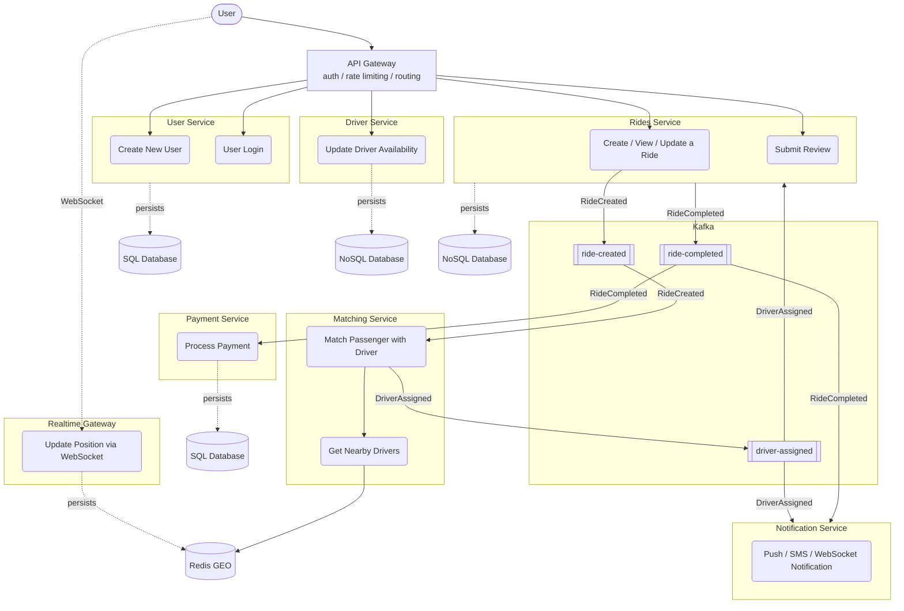

# Esercizio 1 - Higly Scalable Ride-Sharing App (like Uber)

## Assegnazione dei metodi HTTP alle risorse:

### Registrazione e autenticazione
POST /users
POST /auth/login

### Corse
POST /rides
GET /rides/{rideId}
GET /rides?passengerId={passengerId}
POST /rides/{rideId}/accept
POST /rides/{rideId}/start
POST /rides/{rideId}/complete
POST /rides/{rideId}/cancel

### Driver
PUT /drivers/{driverId}/availability

### Posizione (WebSocket)
WS /position

## Schema

## NOTE
- Il **Matching Service** è la parte più critica: trova driver vicini in millisecondi usando Redis GEO (GEOSEARCH/GEORADIUS) su milioni di driver.
- **Kafka** disaccoppia i servizi e gestisce i flussi asincroni: matching, pagamento e notifiche sono tutti event-driven.
- Il **Payment Service** è asincrono per gestire retry, idempotenza e lentezza dei gateway di pagamento esterni.
- Il **Realtime Gateway** gestisce milioni di connessioni WebSocket + Redis Pub/Sub per la posizione in tempo reale.