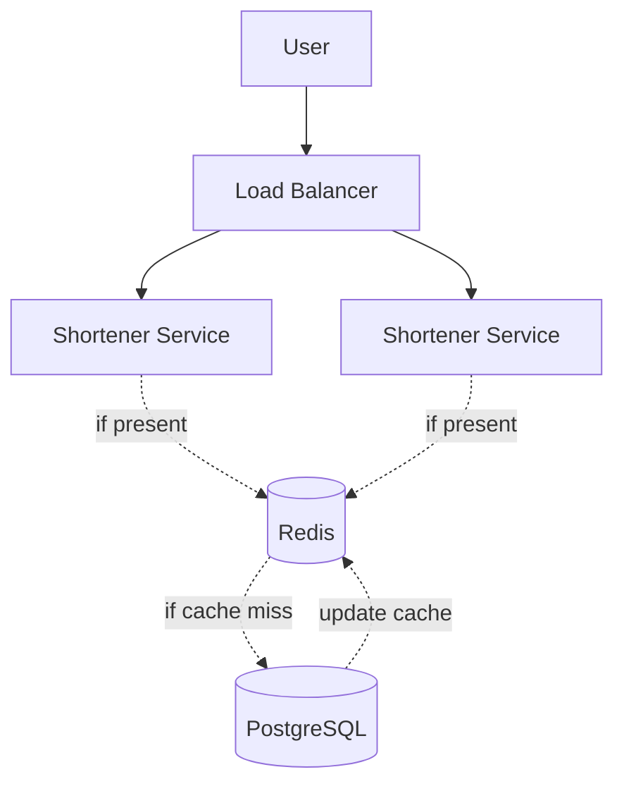

# URL Shortener (Bitly)

# Descrizione
Funzionalità:

Creazione URL corto
Redirect URL
Statistiche click

10 milioni di redirect al giorno
10.000 nuovi URL al giorno

## Requisiti funzionali
- Gli utenti devono poter creare un URL corto a partire da un URL lungo.
- Gli utenti devono poter essere reindirizzati all'URL lungo quando accedono all'URL corto.
- Il sistema deve raccogliere statistiche sui click, come il numero di click e la provenienza geografica.

## Requisiti non funzionali
- Scalabilità per gestire 10 milioni di redirect al giorno e 10.000 nuovi URL al giorno.
- Performance con una latenza inferiore a 100ms per il redirect.
- Disponibilità del 99.9%.

## API
- POST /shortLink: per creare un nuovo URL corto.
- GET /{shortLink}: per reindirizzare all'URL lungo.
- GET /stats/{shortLink}: per ottenere le statistiche di un URL corto.

## Rappresentazione architetturale
Visto che comunque le richieste sono molte, una cache credo che sia la soluzione migliore. 
Come Database sceglierei comunque un SQL, visto che i campi sono pochi (id, shortLink, longLink, clickCount, country) e non c'è bisogno di scalabilità estrema.
Sono titubante sul load balancer.
