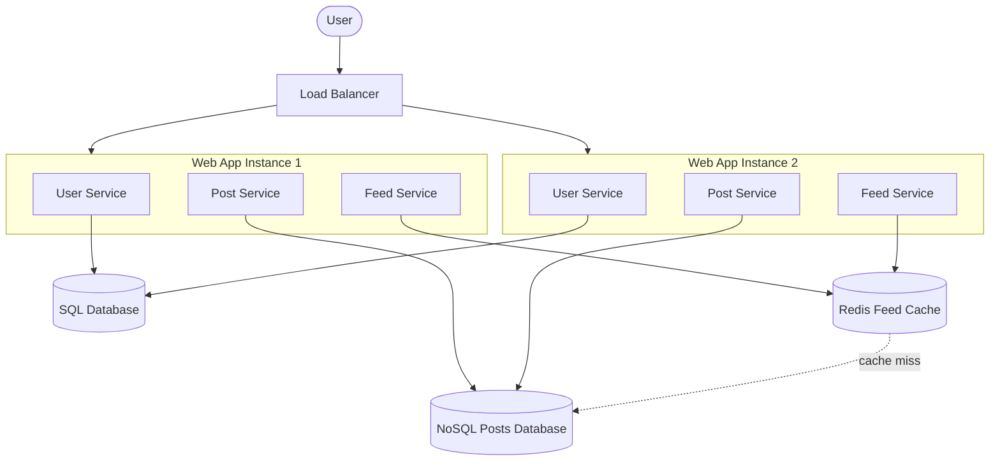

# Social Network (Twitter)

# Descrizione
Funzioni:
- pubblicare post
- leggere feed
- like

Requisiti:
- alta lettura
- feed veloce
## Requisiti funzionali
- Gli utenti si possono registrare e accedere al sistema.
- Gli utenti possono pubblicare post.
- Gli utenti possono visualizzare il feed dei post pubblicati dagli utenti che seguono.
- Gli utenti possono mettere like ai post.

## Requisiti non funzionali
- Gli utenti devono poter visualizzare il feed con una latenza inferiore a 200ms.
- Il sistema deve essere scalabile per supportare un gran numero di utenti e post.
- Gli utenti devono poter visualizzare i post più recenti in cima al feed.
- Gli utenti devono vedere almeno 20 post nel loro feed prima di dover effettuare un'ulteriore azione (es. scroll).

## API
- POST /register: per registrare un nuovo utente.
- POST /login: per autenticare un utente esistente.
- POST /post: per pubblicare un nuovo post.
- GET /feed: per visualizzare il feed dei post.
- POST /like: per mettere like a un post.
- GET /post/{postId}/likes: per visualizzare il numero di like di un post.

## Rappresentazione architetturale
