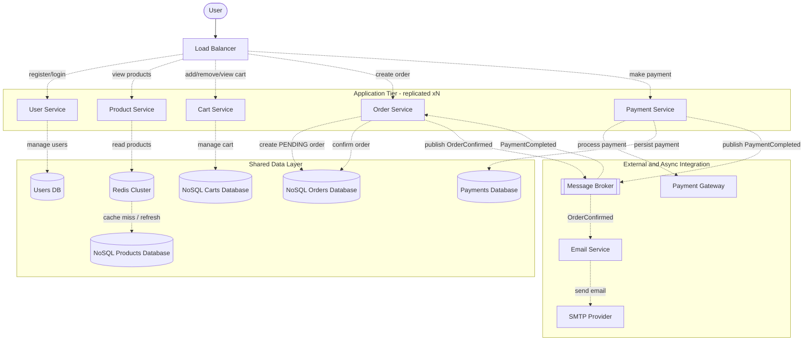

# E-Commerce

## Descrizione
Funzionalità:

Catalogo prodotti
Carrello
Ordini
Pagamenti
Email conferma

Requisiti
50.000 utenti contemporanei

## Requisiti funzionali
- Gli utenti possono registrarsi e accedere al sistema.
- Gli utenti possono visualizzare il catalogo dei prodotti.
- Gli utenti possono aggiungere prodotti al carrello.
- Gli utenti possono rimuovere prodotti dal carrello.
- Gli utenti possono visualizzare il contenuto del carrello.
- Gli utenti possono effettuare ordini.
- Gli utenti possono effettuare pagamenti per gli ordini.
- Gli utenti ricevono un'email di conferma dopo aver effettuato un ordine.

## Requisiti non funzionali
- Il sistema deve essere in grado di gestire almeno 50.000 utenti contemporanei.
- Il sistema deve garantire tempi di risposta rapidi per tutte le operazioni, con una latenza massima di 200ms.
- Il sistema garantire il 99.9% di disponibilità.

## API
- POST /register: per registrare un nuovo utente.
- POST /login: per autenticare un utente esistente.
- GET /products: per visualizzare il catalogo dei prodotti.
- POST /cart: per aggiungere un prodotto al carrello.
- DELETE /cart: per rimuovere un prodotto dal carrello.
- GET /cart: per visualizzare il contenuto del carrello.
- POST /orders: per creare un ordine in stato PENDING.
- POST /payments: per effettuare il pagamento di un ordine PENDING.
- GET /orders/{id}: per visualizzare stato e dettagli dell'ordine.

## Rappresentazione architetturale

## Note
- Il diagramma e' stato reso piu' leggibile come vista logica: le web app sono rappresentate come tier replicato xN, invece di disegnare ogni replica separatamente.
- Le osservazioni sul diagramma iniziale erano corrette: Redis e Message Broker non dovrebbero stare dentro ogni istanza applicativa, ma essere componenti condivisi e scalabili a parte.
- Per mantenere i vari service senza rendere il flusso tutto sincrono, l'ordine viene creato in stato PENDING; il Payment Service elabora il pagamento e pubblica l'evento PaymentCompleted; solo a quel punto l'Order Service aggiorna l'ordine a CONFIRMED e pubblica OrderConfirmed.
- L'invio email non dovrebbe essere una chiamata diretta dell'Order Service: serve un Email Service che consumi OrderConfirmed dal broker e invochi un provider SMTP o un servizio esterno di email.
- Redis ha molto senso davanti al catalogo prodotti, che e' read-heavy. A questo livello e' meglio modellarlo come Redis Cluster condiviso, non come una cache diversa per ogni replica della web app.
- Se vuoi rendere il design ancora piu' chiaro, il passo successivo e' aggiungere gli stati dell'ordine, ad esempio: PENDING, PAID, CONFIRMED, CANCELLED.