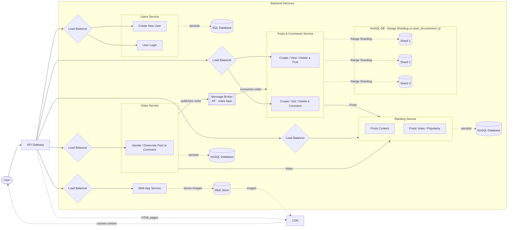

# Functional architecture diagram

# NOTE
Il sistema di aggiornamento dei post più popolari deve essere implementato tramite sliding window, in quanto le 24 ore si spostano per ogni secondo che passa.

Batch processing per gestire i post popolari nelle ultime 24 ore da inserire nel Ranking Service

Il Message Broker usa AP (Availability + Partition Tolerance) per mantenere i voti aggiornati in maniera asincrona tra Votes Service e Posts & Comments Service, senza garanzie di consistenza immediata.