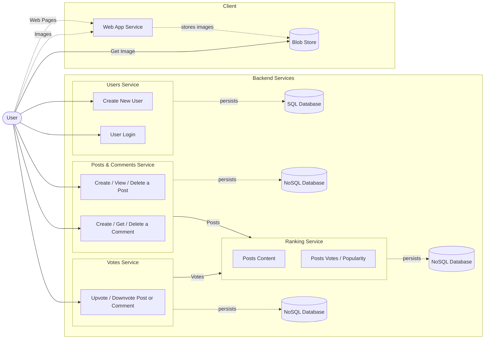

# Functional architecture diagram

# NOTE
Il sistema di aggiornamento dei post più popolari deve essere implementato tramite sliding window, in quanto le 24 ore si spostano per ogni secondo che passa.

Batch processing per gestire i post popolari nelle ultime 24 ore da inserire nel Ranking Service

## Fault tolerance
Replicazione del sito in più data center per quando uno crasha
Più db per ogni servizio

Otteniamo durability gratis facendo tutti questi accorgimenti.