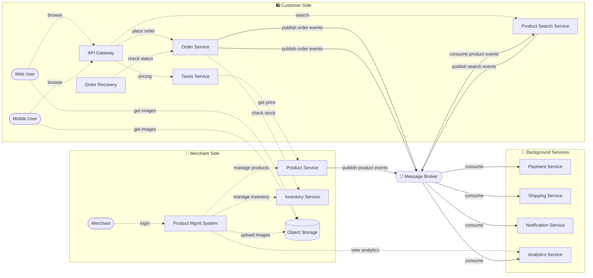

## Merchant Product Management System

```mermaid
flowchart LR

   subgraph MerchantSide["🏪 Merchant Side"]
      direction TB
      M([Merchant]) -. login .-> PMS[Product Mgmt System]
      PMS -. manage products .-> P[Product Service]
      PMS -. manage inventory .-> I[Inventory Service]
      PMS -. upload images .-> OS[(Object Storage)]
   end

   Broker{{"📨 Message Broker"}}

   subgraph CustomerSide["🛍️ Customer Side"]
      direction TB
      WU([Web User]) & MU([Mobile User]) -. browse .-> AG[API Gateway]
      AG -. search .-> PSS[Product Search Service]
      AG -. pricing .-> TS[Taxes Service]
      AG -. place order .-> O[Order Service]
      OR[Order Recovery] -. check status .-> O
   end

   subgraph BackgroundSvc["🔄 Background Services"]
      direction TB
      PS[Payment Service]
      SS[Shipping Service]
      N[Notification Service]
      ALA[Analytics Service]
   end

   %% Cross-domain sync calls
   WU & MU -. get images .-> OS
   TS -. get price .-> P
   O -. check stock .-> I
   PMS -. view analytics .-> ALA

   %% Product catalog sync: P publishes, PSS consumes to update index
   P -->|publish product events| Broker
   Broker -->|consume product events| PSS

   %% Order async: payment, shipping, notifications
   O -->|publish order events| Broker
   Broker -->|consume| PS & SS & N

   %% Analytics: PSS publishes search events, ALA consumes all
   PSS -->|publish search events| Broker
   O -->|publish order events| Broker
   Broker -->|consume| ALA
```
